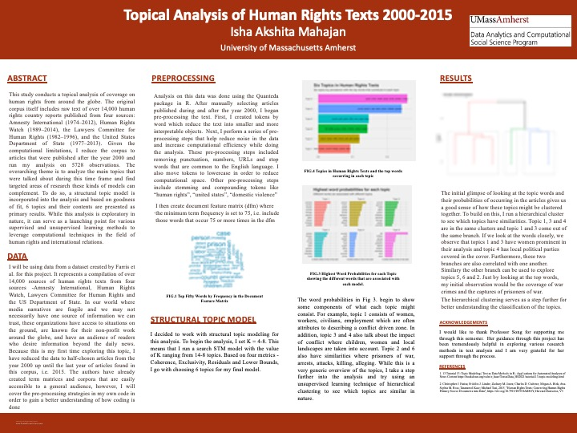

### This study conducts a topical analysis of coverage on human rights from around the globe. The original corpus itself includes raw text of over 14,000 human rights country reports published from four sources:Amnesty International (1974–2012), Human Rights Watch (1989–2014), the Lawyers Committee for Human Rights (1982–1996), and the United States Department of State (1977–2013). I reduce the corpus to articles that were published after the year 2000 and run my analysis on 5728 observations.

---

## Data 

Christopher J. Fariss; Fridolin J. Linder; Zachary M. Jones; Charles D. Crabtree; Megan A. Biek; Ana-Sophia M. Ross; Taranamol Kaur; Michael Tsai, 2015, "Human Rights Texts: Converting Human Rights Primary Source Documents into Data", https://doi.org/10.7910/DVN/IAH8OY, Harvard Dataverse, V3  

## Key Components of the Project: 

1. Importing the data in R and converting it into a corpus
2. Performing important preprocessing steps relevant to the research topic - removing punctuation, numbers, urls and stopwords, converting all words to lowercase and stemming the data to reduce words to the root node.
3. Creating a document feature matrix with the word tokens from the pre-processed text. 
5. Running a structural topic model with setting the covariate as the organization and time of publishing.
6. Running hierarchical clustering to support the interpretation of topics and words based on the model output.

## Libraries used
**R**: readtext, quanteda, stm, factoExtra