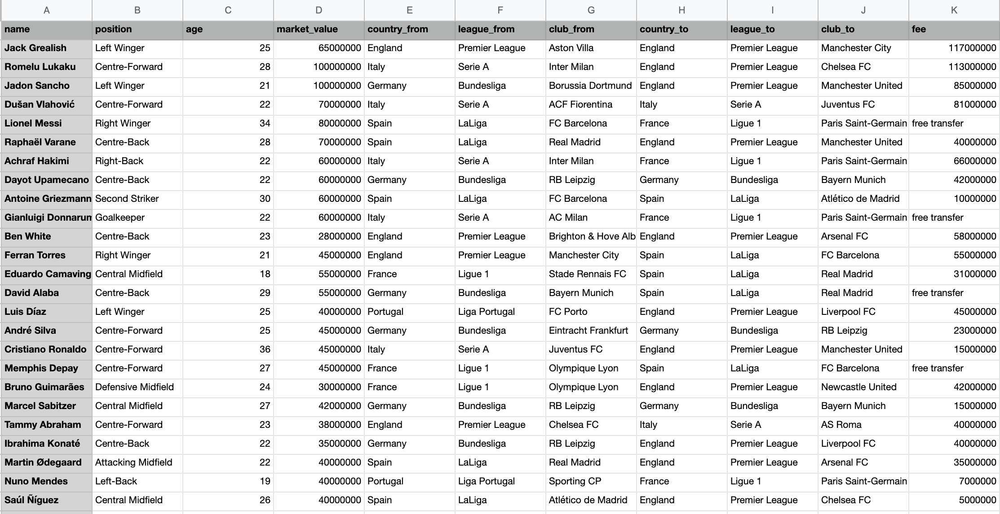

### A social network analysis conducted on transfer of football players in major football leagues across the globe. The data consists of transfers from 8 transfer windows from 2018-2021 and was collected from transfermarkt.uk. The nodes/vertices in the network are the clubs from and to which the transfers take place and the edges are the players who are being transferred. The strength/ weight of the edges is the value of the transfer in $USD. 

## Data 

Used beautiful soup in Python to webscrape data from transfermarket.uk. The data included 8 transfer windows over four years (2018-2021). A sample of the final dataset looked like this:

## Key Components of the Project:
1. Creating edgelists and affiliation matrices 
2. Exploring network degree and overall structures of the network
3. Identifying the key actors in the network: Network Status 
4. Detecting Communities within the network using different algorithms like walktrap community detection and fast greedy
            
            
## Libraries used 
- **R**: Igraph, Statenet, Intergraph, Ggally
- **Python**: Beautiful Soup

