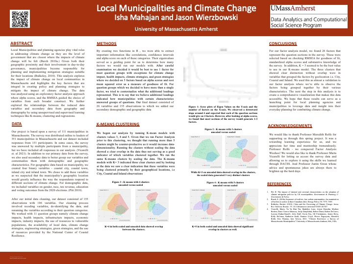

### As part of an independent study with Dr. Meredith Rolfe, a team of two students performed a survey data analysis on data collected by the Massachusetts Municipal Association and the Northeast Center for Coastal Resilience. The survey targeted regional planners and members of local municipalities in Massachusetts and aimed to gather insight on the impacts of climate change on their localities.

---

## Data 

[Here](https://www.mma.org/resource/climate-resilience-a-survey-of-massachusetts-municipalities/) is a link to the Survey Report.

## Key Components of the Project:

1. Stakeholder analysis to get a better understanding of the data from the PIs.
2. Data cleaning and exploratory visualizations to visualize the structure of the data 
3. Factor analysis to reduce data dimensionality. From 157 variables, we removed qualitative assessments and reduced the data to 26 variables by looking at alpha scores, and root mean squared error of approximation (RMSEA) for goodness of fit. 
4. Joining demographic data to municipalities by geolocation. Including data for education levels, voting preferences, median incomes, race geolocation of each municipality i.e. coastal, inland and type of municipality i.e. city or town. 
5. Applying K-Means clustering on scaled and unscaled data to search for clear clusters in the factors  based on their means/centroid properties. 

# Libraries Used 

**R**: tidyverse, psych, factoExtra, pls, tidycensus

